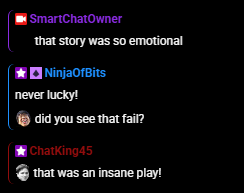
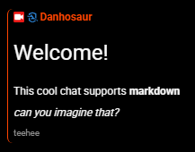

# Danho's Twitch chat

This project is a custom modification of the native StreamElements chat widget for Twitch, designed to enhance chat display and add advanced features for my stream overlay.

## Preview

Below are preview images showing the chat widget in action:

<table align="center"> 
  <tr>
    <td align="center">
      
       
      <em>Threaded message grouping in action</em>
    </td>
    <td align="center">
      
       
      <em>Markdown-like formatting features</em>
    </td>
  </tr>
</table>

## Features
- **Threaded message grouping:** Consecutive messages from the same sender are visually grouped, with start/end styling and dynamic display of sender info.
- **Markdown-like formatting:** Supports headings, bold, italics, strikethrough, inline code, and custom disclaimer styling directly in chat messages.
- **Auto-hide and animation:** Messages fade out after a configurable timeout, with smooth entry/exit animations.

## Usage
You are free to use and modify this code for your own Twitch stream. I don't care much about attribution, but if you find it useful, feel free to give me a shoutout or share your customizations!

## File Structure
- `src/index.html` — Widget HTML template and chat message layout
- `src/script.js` — Main logic for message grouping, markdown parsing, and event handling
- `src/style.css` — Custom styles for chat appearance, threads, and animations
